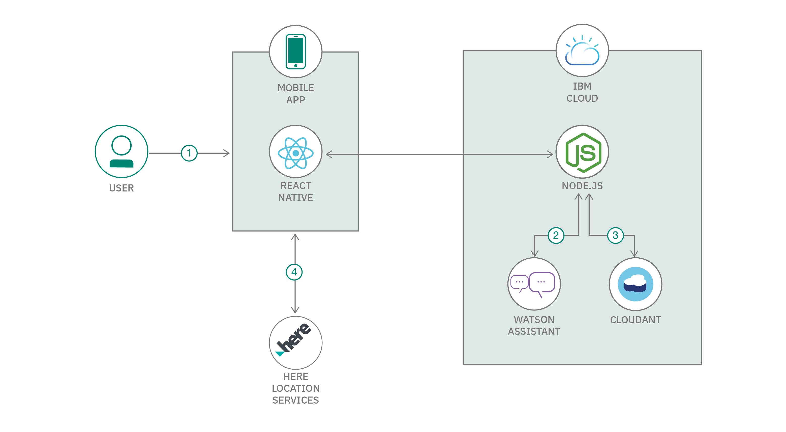

# Community Hub – A collaboration channel 
Cognizant Resilinece & Reliability (R2) Engineering ™ team's submission for IBM Call for Code (CFC 2020) Hackathon.

## Overview
Communities need to cooperate among themselves to solve their needs in times of crisis, whether it be to advertise where supplies are held, offer assistance for collections, or other local services like volunteer deliveries. Many of the nations in the world need to lockdown their cities for prolonged duration to control the COVID-19 spread. People in the respective cities and communities run out of essential food, household and other supplies very quick. Their essential needs has to be full filled in secured manner with social distancing. 

This mobile application is for the people in need to find nearby supplies for their essential demands during crisis situations. It also provide a channel to offer voluntary services, donations to the needed communities. By using this application, communityies will be able to view,
1. Top demand and supplies in their localties
2. Lookup the supplies for their demands using chatbot 
3. Facility to post the vegetable stock by farmers/producers, voluntary service providers, locality needs of community people to see and respond

## Technology Stack

1. Reactive Native - UI
2. Node.js - API
3. IBM Cloudant - Database (No-SQL)
4. IBM Watson Assistant - Chat-bot
5. IBM Cloud - Cloud Foundary Services

## Logic flow
This solution has a chat interface built using IBM Watson Assistant, data storage to hold the status of demands and supplies available, and location services with real-time information to get users the information they need.

IBM Cloud services provide an easy way of implementing the solution using,
1. Application is developed using React Native for UI, Node.js for API layer with IBM Cloudant No-SQL database at the backend levaraging IBM's statrtup kit for the hackathon
2. Application is hosted as Cloud Foundary Services on IBM cloud
3. IBM Watson Assistan for Chatbot integration to post the demand and get nearby supplies with contact details as response. Chatbot also helps to add supplies and dontations by invoking backend Node.js API hosted
